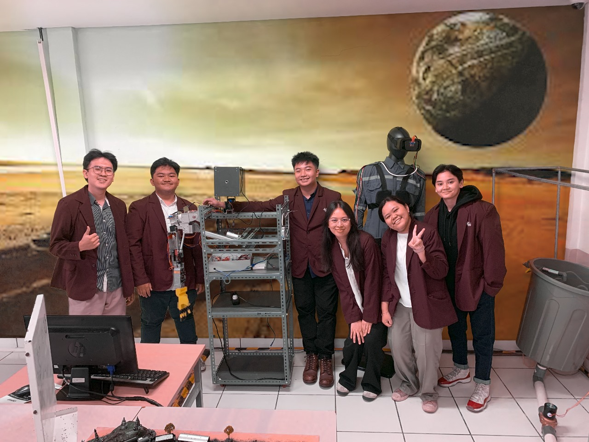
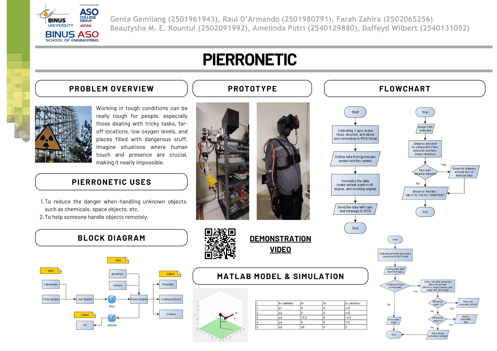

# Pierronetic
The Pierronetic humanoid robot arm is an innovation designed to mimic human hand movements, encompassing articulation from the arm down to the finger motions. This technology incorporates machine learning for human detection, distance calculation, ensuring safety in its deployment, and IoT communication with ROS(Robotic Operation System)

---

### Table of Contents

- [Description](#description)
- [Documentation](#documentation)
- [Author Info](#author-info)

---

## Description
This robot contains some interesting feature :

1. Human-Mimicking Movements
The Pierronetic robot arm is engineered to replicate the intricate movements of the human hand. Its sophisticated design allows for a wide range of articulation, enabling tasks that require fine motor skills and dexterity.

2. Machine Learning Integration
Incorporating state-of-the-art machine learning algorithms, the robot arm is equipped with human detection capabilities. This technology enhances safety by ensuring the robot is aware of its surroundings and can interact safely with humans in its vicinity.

3. Distance Calculation for Safety
The Pierronetic robot arm utilizes advanced distance calculation algorithms to assess its proximity to objects and individuals. This feature contributes to the overall safety of its deployment, preventing collisions and ensuring a secure working environment.

4. IoT Communication with ROS
The robot arm is integrated with the Robotic Operating System (ROS), facilitating seamless communication with the Internet of Things (IoT) ecosystem. This connectivity enhances the robot's capabilities, allowing for remote operation, data exchange, and integration with other smart systems.

#### Technologies

- ROS
- Convolutional Neural Network
- RTMP Streaming

[Back To The Top](#Pierronetic)

---

## Documentation

[Back To The Top](#Pierronetic)

---
## Author Info

- Instagram - [daffeydwilbert](https://www.instagram.com/daffeydwilbert/)
- Email - daffeydwilbert@gmail.com

[Back To The Top](#Pierronetic)
